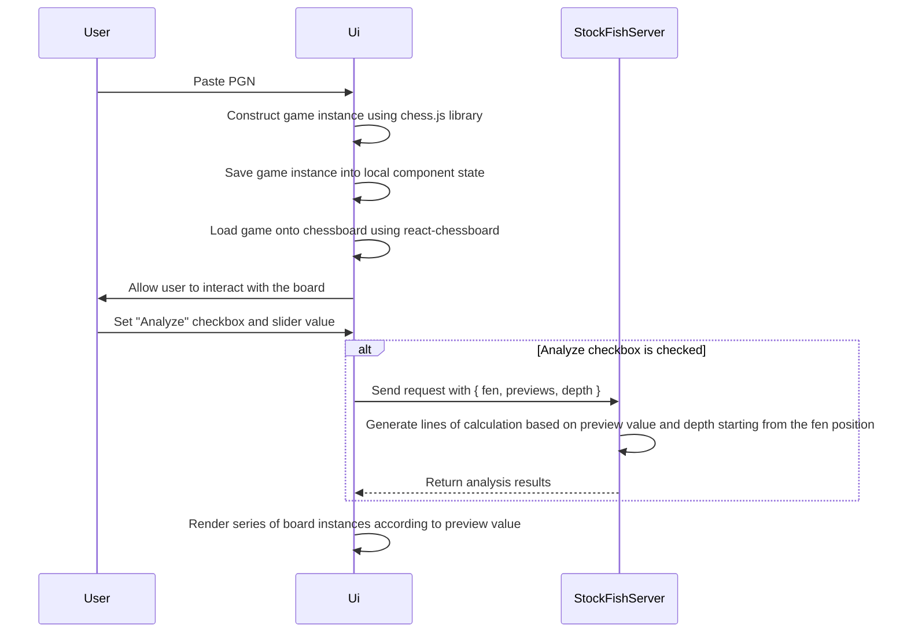

```mermaid
sequenceDiagram
    participant User
    participant Ui
    participant StockFishServer

    User->>Ui: Paste PGN
    Ui->>Ui: Construct game instance using chess.js library
    Ui->>Ui: Save game instance into local component state
    Ui->>Ui: Load game onto chessboard using react-chessboard
    Ui->>User: Allow user to interact with the board
    User->>Ui: Set "Analyze" checkbox and slider value

    alt Analyze checkbox is checked
        Ui->>StockFishServer: Send request with { fen, previews, depth }
        StockFishServer->>StockFishServer: Generate lines of calculation based on preview value and depth starting from the fen position
        StockFishServer-->>Ui: Return analysis results
    end

    Ui->>Ui: Render series of board instances according to preview value

```